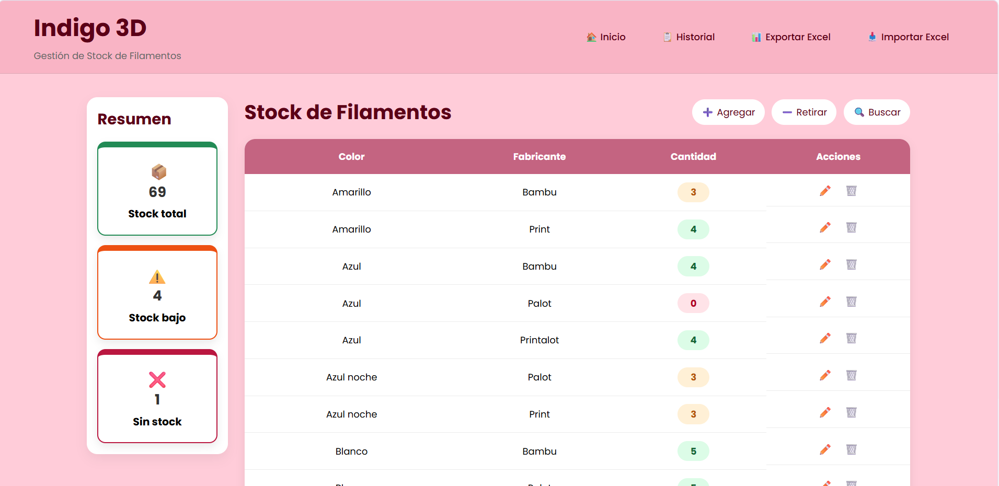
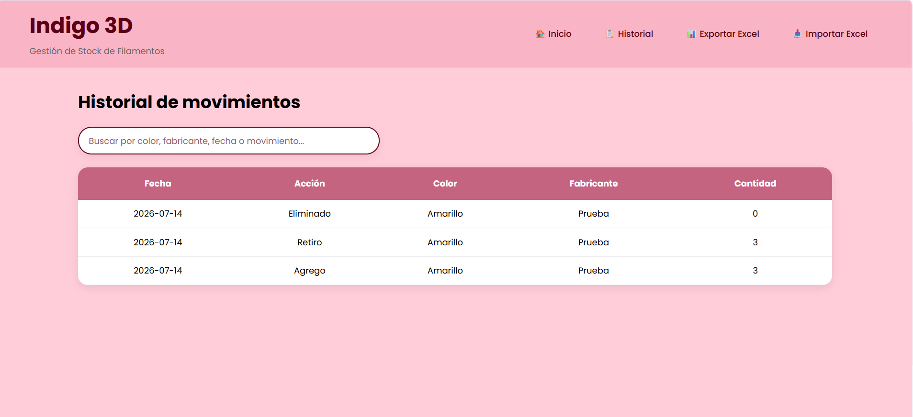
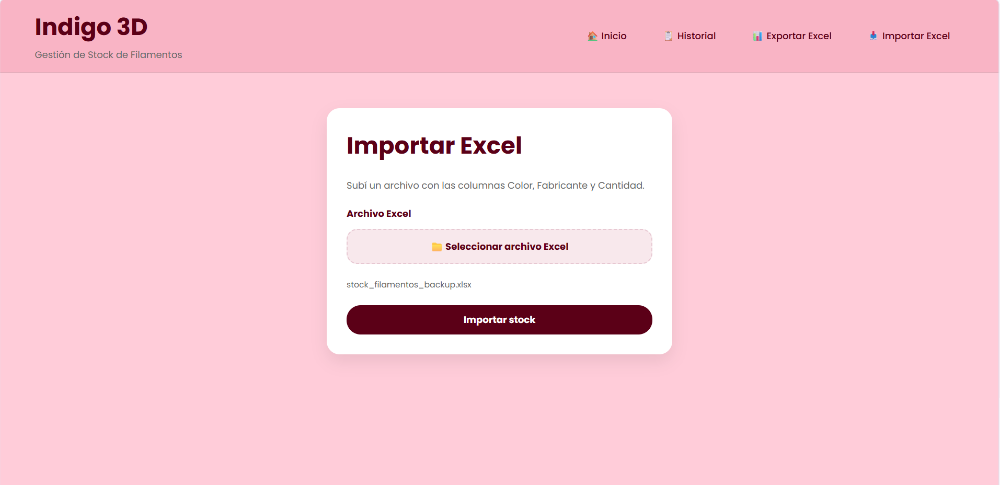
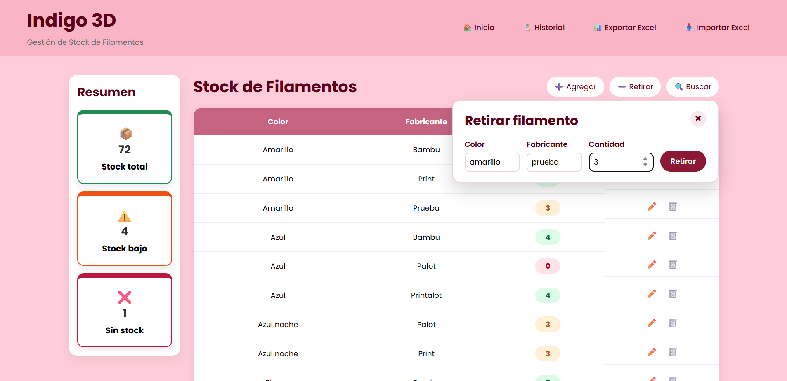

# Aplicación web de gestión de stock - Python/Flask

Aplicación web desarrollada con Python y Flask para gestionar el stock de filamentos de impresión 3D.

El proyecto fue pensado y diseñado a partir de una necesidad real observada durante mi experiencia laboral en Indigo 3Design, donde trabajé en operaciones y producción con impresoras 3D. Durante el desarrollo fui consultando criterios de uso y necesidades prácticas con mi anterior jefe, quien también podrá probar la aplicación.

La aplicación permite registrar, consultar, modificar, importar y exportar información de stock de filamentos desde una interfaz web simple. Fue desarrollada como proyecto personal de práctica y portfolio, aplicando conceptos de programación, manejo de datos, organización de código y desarrollo web.

## Funcionalidades principales

- Visualización del stock de filamentos en una tabla web.
- Registro de nuevos filamentos con color, fabricante y cantidad.
- Edición de datos existentes.
- Agregado y retiro de stock.
- Eliminación de filamentos.
- Buscador por color o fabricante.
- Historial de movimientos.
- Exportación del stock a Excel.
- Importación de stock desde Excel.
- Resumen visual de stock total, stock bajo y filamentos sin stock.
- Organización del código en módulos para separar responsabilidades.

## Tecnologías utilizadas

- Python
- Flask
- HTML
- CSS
- JavaScript
- JSON
- Excel / openpyxl
- Git y GitHub

## Qué desarrollé

Este proyecto fue desarrollado de forma personal para practicar programación y desarrollo web, tomando como referencia una necesidad operativa real vinculada a la gestión de stock de filamentos.

Durante el desarrollo trabajé en:

- Análisis de una necesidad operativa real vinculada a la gestión de stock.
- Diseño de la estructura principal del sistema.
- Creación de rutas y vistas con Flask.
- Manejo de datos mediante estructuras de Python.
- Persistencia de información usando archivos JSON.
- Importación y exportación de datos con archivos Excel.
- Funciones para agregar, buscar, editar, retirar y eliminar stock.
- Registro de movimientos en un historial.
- Desarrollo de una interfaz web simple y funcional.
- Separación del código en distintos archivos y módulos.

## Ejecución local

Actualmente el proyecto se ejecuta de forma local con Python.

1. Clonar el repositorio:

```bash
git clone https://github.com/bartolomefamea/gestion-stock-filamentos.git
```

2. Entrar a la carpeta del proyecto:

```bash
cd gestion-stock-filamentos
```

3. Instalar las dependencias necesarias:

```bash
pip install -r requirements.txt
```

4. Ejecutar la aplicación:

```bash
python app.py
```

5. Abrir en el navegador:

```text
http://127.0.0.1:5000
```
El repositorio incluye un archivo stock_ejemplo.xlsx para probar la importacion de datos desde Excel.

**Próximas mejoras**

```md
## Próximas mejoras

- Mejorar validaciones al importar archivos Excel.
- Agregar filtros más avanzados al historial.
- Mejorar el diseño responsive.
- Agregar identificación visual automática de colores de filamento.
- Preparar una forma más simple de ejecución para usuarios finales.
- Evaluar una futura versión desplegada o empaquetada.

## Uso básico

Desde la pantalla principal se puede consultar el stock disponible y acceder a las acciones principales.

El usuario puede:

- Agregar nuevos filamentos.
- Retirar unidades del stock.
- Editar datos cargados.
- Eliminar registros.
- Buscar filamentos por color o fabricante.
- Consultar el historial de movimientos.
- Exportar el stock a Excel.
- Importar un archivo Excel con datos de stock.

Para importar un archivo Excel, debe respetar una estructura simple con las siguientes columnas:

```text
Color | Fabricante | Cantidad
```

## Capturas de pantalla

### Pantalla principal


### Historial de movimientos


### Importación de Excel


### Acción en el stock



## Próximas mejoras

- Mejorar validaciones al importar archivos Excel.
- Mostrar mensajes visuales de éxito o error al usuario.
- Mejorar el diseño responsive.
- Agregar filtros más avanzados al historial.
- Preparar una forma más simple de ejecución para usuarios finales.
- Evaluar una futura versión desplegada o empaquetada.

## Aclaración

Este es un proyecto personal desarrollado con fines de aprendizaje y portfolio, inspirado en una necesidad operativa real observada durante mi experiencia laboral.

No está planteado como un sistema empresarial terminado ni como un desarrollo oficial de Indigo 3Design, sino como una aplicación funcional para practicar Python, Flask, manejo de datos, organización de código y documentación en GitHub.

## Autor

Bartolomé Famea  
Estudiante de Ingeniería en Sistemas de Información - UTN
